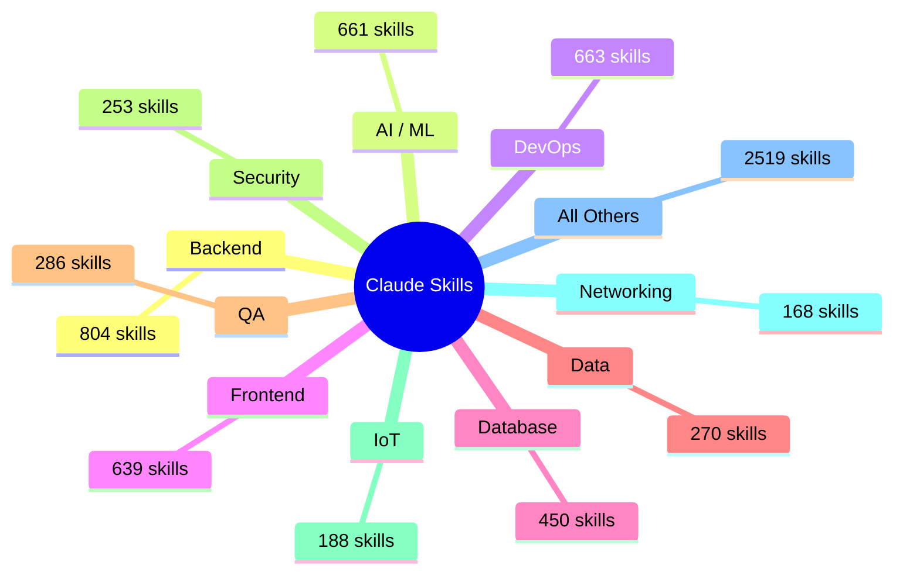

# ⚡ Библиотека Навыков Claude | Claude Skills Library

<div align="center">

**6901+ готовых навыков для Claude.ai | 6901+ Pre-Built Skills That Supercharge Your Claude.ai**

[](LICENSE)
[](.claude/skills/)
[](#-что-внутри--whats-inside)
[](https://github.com/ssrjkk/claude-skills/commits)
[](.github/CONTRIBUTING.md)
[](https://github.com/ssrjkk/claude-skills)
[](https://hits.seeyoufarm.com)

---

## 🚀 О проекте | About

### RU
**Хватит тратить токены на объяснение контекста.**
Каждый раз, прося Claude написать код, ты тратишь драгоценные токены на повторение одного и того же:

- *"Напиши FastAPI приложение с JWT авторизацией..."*
- *"Создай Dockerfile с multi-stage сборкой..."*
- *"Настрой CI/CD пайплайн с GitHub Actions..."*

**⚡ Это кончается сегодня.**

С нашей библиотекой навыков Claude загружает идеальный скилл в один клик — проверенные инструкции, реальные примеры, ноль воды.

> **Клонируй один раз. Используй в каждом проекте. Никогда не объясняй основы заново.**

### EN
**Stop wasting tokens on context.**
Every time you ask Claude to write code, you burn precious tokens re-explaining the same patterns.

**⚡ That stops now.**

With one click, Claude loads the exact skill it needs — battle-tested instructions, real-world examples, and zero fluff.

> **Clone once. Use for every project. Never re-explain the basics.**

---

## ✨ Что ты получаешь | What You Get

| | |
|---|---|
| **6901 готовых навыков** | backend, frontend, mobile, devops, AI, security, blockchain, и ещё 30+ доменов |
| **Экономия часов** | никакого промпт-инжиниринга, никакого повторения контекста |
| **Production-ready** | проверенные паттерны, лучшие практики |
| **Бесплатно** | работает локально в Claude.ai, никаких API ключей |
| **Оффлайн** | всё в твоём репозитории, ничего в облаке |
| **38 доменов** | от FastAPI до Unreal Engine, от Kafka до Solidity |

---

## 🎯 Старт за 30 секунд | 30 Seconds To Start

```bash
git clone https://github.com/ssrjkk/claude-skills.git
```

1. Открой **Claude.ai → Settings → Skills → Add local folder**
2. Укажи путь **`claude-skills/.claude/skills/`**
3. Напиши: *"Use skill python-fastapi to build a CRUD API"*

**✅ Claude теперь знает, что делать.**

---

## 📊 Что внутри | What's Inside

### 👑 Топ-10 доменов | Top 10 Domains

| # | Домен Domain | 🛠 Навыков Skills | 🔥 Примеры Examples |
|:-:|:------------|:-----------------:|:-------------------|
| 1 | 🖥 **Backend** | 804 | django, express, spring-boot, actix-web, laravel, rails, fastify, gin, microservices, cqrs |
| 2 | 🤖 **AI / ML** | 661 | langchain, pytorch, tensorflow, opencv, transformers, langgraph, crewai, claude-code, mcp |
| 3 | 🎨 **Frontend** | 639 | react, vue, angular, svelte, nextjs, nuxt, tailwind, shadcn-ui, bun |
| 4 | 🛠 **DevOps** | 663 | docker, kubernetes, terraform, ansible, prometheus, github-actions, aws, helm, platform-engineering |
| 5 | 🗄 **Database** | 450 | postgresql, mongodb, redis, elasticsearch, neo4j, supabase, neon |
| 6 | 📊 **Data** | 270 | pandas, spark, airflow, dbt, kafka, flink, snowflake, bigquery |
| 7 | 🧪 **QA / Testing** | 286 | pytest, jest, cypress, playwright, k6, selenium, jmeter, ai-testing |
| 8 | 🔒 **Security** | 253 | owasp, nmap, wireshark, oauth2, gdpr, trivy, defi-security, zk-proofs |
| 9 | 💻 **OS Admin** | 200 | ubuntu, debian, rhel, systemd, bash, powershell, active-directory |
| 10 | 📡 **IoT** | 188 | arduino, esp32, raspberry-pi, home-assistant, platformio, mqtt |

### 🌐 Все 38 доменов | All 38 Domains

| Домен Domain | Навыков Skills | Примеры Examples |
|:------------|:--------------:|:----------------|
| 🖥 Backend | 804 | django, express, spring-boot, actix-web, laravel, rails, fastify, gin, microservices, cqrs |
| 🤖 AI / ML | 661 | langchain, pytorch, tensorflow, opencv, transformers, langgraph, crewai, claude-code, mcp |
| 🛠 DevOps | 663 | docker, kubernetes, terraform, ansible, prometheus, github-actions, aws, helm, platform-engineering |
| 🎨 Frontend | 639 | react, vue, angular, svelte, nextjs, nuxt, tailwind, shadcn-ui, bun |
| 🗄 Database | 450 | postgresql, mongodb, redis, elasticsearch, neo4j, supabase, neon |
| 📊 Data | 270 | pandas, spark, airflow, dbt, kafka, flink, snowflake, bigquery |
| 🧪 QA / Testing | 286 | pytest, jest, cypress, playwright, k6, selenium, jmeter, ai-testing |
| 🔒 Security | 253 | owasp, nmap, wireshark, oauth2, gdpr, trivy, defi-security, zk-proofs |
| 💻 OS Admin | 200 | ubuntu, debian, rhel, systemd, bash, powershell, active-directory |
| 📡 IoT | 188 | arduino, esp32, raspberry-pi, home-assistant, platformio, mqtt |
| 🌐 Networking | 168 | tcp/ip, dns, bgp, http, vpn, wireshark, iptables |
| 🎮 Gamedev | 153 | unity, unreal, godot, bevy, phaser, level-design, game-balance |
| ⛓ Blockchain | 151 | ethereum, solana, cosmos, polygon, zksync, defi, solidity-optimization |
| 📋 Product | 150 | agile, scrum, kanban, okr, user-stories, design-thinking, roadmapping |
| 🎨 Design | 138 | figma, storybook, tailwind, radix-ui, user-research, prototyping |
| 📞 Communications | 136 | webrtc, voip, sip, twilio, slack-api, discord-bot, sendgrid |
| 🔧 Engineering | 127 | code-review, tdd, ddd, uml, system-design, ai-testing, clean-code |
| 👥 HR / Recruiting | 112 | workday, bamboohr, greenhouse, linkedin-recruiter, payroll, ats |
| 📱 Mobile | 109 | react-native, flutter, swift-ios, kotlin-android, expo-rn, capacitor |
| 🖥 Desktop | 108 | electron, tauri, qt, javafx, pyqt, tkinter, avalonia |
| 📦 Supply Chain | 106 | sap, oracle-scm, warehouse-mgmt, transportation, inventory, logistics |
| 🛒 Ecommerce | 102 | shopify, magento, woocommerce, commercetools, medusa, bigcommerce |
| 🎬 Media | 102 | ffmpeg, hls, davinci, premiere, after-effects, gstreamer |
| ❤️ Healthcare | 96 | fhir, hipaa, hl7, dicom, ehr, telehealth, population-health |
| 🌍 Geospatial | 96 | qgis, arcgis, postgis, leaflet, mapbox, google-maps, geoserver |
| 💰 Finance | 96 | algo-trading, plaid, open-banking, risk-management, backtesting |
| ⚙️ Embedded | 89 | arm-cortex, risc-v, freertos, zephyr, rtos, bootloader, rust-embedded |
| 💳 Payments | 88 | stripe, paypal, square, adyen, paddle, chargebee, subscriptions |
| 🥽 AR / VR | 80 | arkit, arcore, webxr, openxr, steamvr, hololens, unity-xr |
| 🔬 Scientific | 80 | numpy, scipy, sympy, matlab, julia, r-lang, signal-processing |
| ⚡ Energy | 78 | scada, plc, modbus, solar-pv, battery-storage, smart-grid |
| 📚 Education | 68 | moodle, canvas, lti, xapi, scorm, open-edx, teachable |
| 🌿 Sustainability | 48 | esg, csrd, gri, carbon-accounting, ghg-protocol, sbti |
| 🟦 block | 2 | block-development, block-integration |
| 🧪 api-testing | 3 | api-testing-framework, rest-assured, postman |
| 🔄 ci-cd-setup | 3 | github-actions-setup, gitlab-ci-setup, jenkins-setup |
| 🗃 database-migration | 3 | alembic, flyway, liquibase |
| 📈 test-reporting | 3 | allure, extent-reports, mochawesome |

---

## 🏆 Новые навыки 2026 | New 2026 Skills

| Skill | Domain | Description RU | Description EN |
|-------|--------|---------------|----------------|
| 🧠 MCP Server | AI | Model Context Protocol сервер для интеграции инструментов | Model Context Protocol server for tool integration |
| 🤖 Claude Code | AI | Claude Code CLI для автономной разработки | Claude Code CLI for autonomous development |
| 🔗 LangGraph Agents | AI | Построение сложных AI-агентов с LangGraph | Building complex AI agents with LangGraph |
| ✨ Vibe Coding | AI | Методология вайб-кодинга на максималках | Vibe coding methodology on steroids |
| 🖥 Cursor IDE | AI | Работа с Cursor IDE и AI-фичами | Working with Cursor IDE and AI features |
| 🌊 Windsurf IDE | AI | Работа с Windsurf IDE | Working with Windsurf IDE |
| 🔍 AI Code Review | AI | AI-ревью кода на базе Claude | AI-powered code review with Claude |
| 🛡 AI Safety | AI | Безопасный AI: guardrails и alignment | Safe AI: guardrails and alignment |
| 📚 RAG Advanced | AI | Продвинутые RAG-паттерны и pipelines | Advanced RAG patterns and pipelines |
| 🎯 Prompt Engineering | AI | Инженерия промптов для Claude | Prompt engineering for Claude |
| 🎨 shadcn/ui | Frontend | Компоненты shadcn/ui и Radix UI | shadcn/ui components and Radix UI |
| 🌀 React Server Components | Frontend | RSC, SSR и Server Actions | RSC, SSR and Server Actions |
| ⚡ Bun Runtime | Backend | Bun.js рантайм и инструменты | Bun.js runtime and tooling |
| 🦀 Rust Tokio | Backend | Асинхронный Rust с Tokio | Async Rust with Tokio |
| 🔷 Supabase | Database | Backend-as-a-Service с Supabase | Backend-as-a-Service with Supabase |
| 💚 Neon Serverless | Database | Serverless PostgreSQL с Neon | Serverless PostgreSQL with Neon |
| 🎭 WebAssembly | Frontend | Wasm с Rust и JS | Wasm with Rust and JS |
| ☸️ Kubernetes AI | DevOps | AI-нагрузки на Kubernetes | AI workloads on Kubernetes |
| 📐 Platform Engineering | DevOps | Платформенный инжиниринг и Internal Developer Platform | Platform engineering and Internal Developer Platform |
| 💵 FinOps | DevOps | Облачный FinOps и оптимизация затрат | Cloud FinOps and cost optimization |
| 🔭 LLM Observability | DevOps | Наблюдаемость LLM и AI-приложений | LLM and AI application observability |
| ⛓️ ZK Proofs | Blockchain | Zero-knowledge доказательства и zkRollups | Zero-knowledge proofs and zkRollups |
| 🔐 DeFi Security | Blockchain | Безопасность DeFi протоколов и смарт-контрактов | DeFi protocol and smart contract security |

---

## 📈 По цифрам | By The Numbers



- **6901** навыков готовы к использованию
- **38** доменов — от бэкенда до устойчивого развития
- **38** категорий
- **0** затрат на настройку — клонируй и пользуйся

---

## 💡 Почему стартапы это обожают | Why Startups Love This

**RU:** Ты строишь быстро. Каждый час, потраченный на написание промптов — это час, который ты не тратишь на свой продукт. Джуниоры получают архитектуру уровня сеньоров. Сеньоры пропускают шаблонный код. Ты остаёшься в потоке.

**EN:** You're building fast. Every hour spent crafting prompts is an hour not spent on your product. Junior devs get senior-level architecture patterns. Senior devs skip boilerplate. You stay in flow.

---

## 🚀 Примеры использования | Usage Examples

```text
"Use skill python-fastapi to build a CRUD API with SQLAlchemy"
"Use skill spring-boot-microservice for a REST API with Eureka"
"Use skill langchain-rag to build a RAG pipeline with ChromaDB"
"Use skill pytorch-training to train a transformer model"
"Use skill kubernetes-deployment to deploy a microservice on EKS"
"Use skill terraform-aws to provision an ECS cluster"
"Use skill react-component-library to build a reusable UI kit"
"Use skill nextjs-fullstack for a SaaS boilerplate with auth"
"Use skill solidity-smart-contract to create an ERC-721 NFT contract"
"Use skill web3-dapp to build a React dApp with ethers.js"
"Use skill owasp-api-security to secure your REST endpoints"
"Use skill flutter-cross-platform to build a chat app"
"Use skill unity-game-mechanics to implement a combat system"
"Use skill godot-2d-platformer to create a pixel-art game"
"Use skill mcp-server to build a Model Context Protocol server"
```

---

## 🤝 Как помочь | How To Contribute

```bash
git clone https://github.com/YOUR_USERNAME/claude-skills.git
python scripts/validate-all.py
python scripts/deep-validate.py
```

Затем открой PR. 5 минут — и твой навык получит каждый пользователь.

📖 [Guide](.github/CONTRIBUTING.md) | 📋 [Best Practices](.github/BEST_PRACTICES.md) | 💡 [Examples](.github/EXAMPLES.md)

---

## 📬 Контакты | Contacts

| | |
|---|---|
| Telegram | [@ssrjkk](https://t.me/ssrjkk) |
| Email | [ray013lefe@gmail.com](mailto:ray013lefe@gmail.com) |
| GitHub | [@ssrjkk](https://github.com/ssrjkk) |

---

<div align="center">

**⭐ Поставь звезду, если проект полезен! | Star if you find this useful!**

**6901 навыков. 38 доменов. 0 границ. 🚀**

</div>
